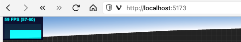

# 排查结论

对网页性能造成影响的因素：

- 使用的框架 (ruoyi 和 vite 和纯 html)
- 高德 api 开启地形图 ( terrain )
- 地图缩放的大小

未显著造成影响的因素：

- js 库的加载方式 (import 和 script src)
- three 场景初始化，光源，环境贴图

# 背景介绍

参考这个[利用 ThreeJS 实现动态围栏效果](https://lbs.amap.com/demo/javascript-api-v2/developer-example/threejs/threejs_dynamic_polyline)的时候，发现 fps 比项目中的高很多，并且也很稳定，就想探究一下差异原因。

# 整体思路

**寻找两边代码的不同，将不同之处逐一改成一致查看性能变化**

# 具体操作

1. 去掉项目中多余的业务代码，用只加载地图基本内容的基础代买来进行性能比较
1. 调整项目的加载方式，使得项目代码尽量接近
1. 调整两边的地图初始化配置，看是否是地图配置的影响

# 比对项详细说明

## 使用的框架

ruoyi 和 vite 和 html 三者的 fps 对比

ruoyi:

vite:

原生 html:

---

vite 和原生的 fps 都要比 ruoyi 高 10 以上
（通过电源的功率计有另一个发现，虽然 ruoyi 的 fps 低一点，但功率也会低 5-10w）

三者的代码在 `ruoyi.html` 和 `vite.html` 以及 [codepen](https://codepen.io/boblunt/full/vYMMqLp)，（三者的 style 和 script 都几乎一样。）

## 高德 api 开启地形图

> terrain: true

> terrain: false

---

关闭了地形图之后，fps 基本稳在了 60

## 地图缩放的大小

> zoom: 10

> zoom: 14

---

放大地图之后，fps 也基本稳在了 60
